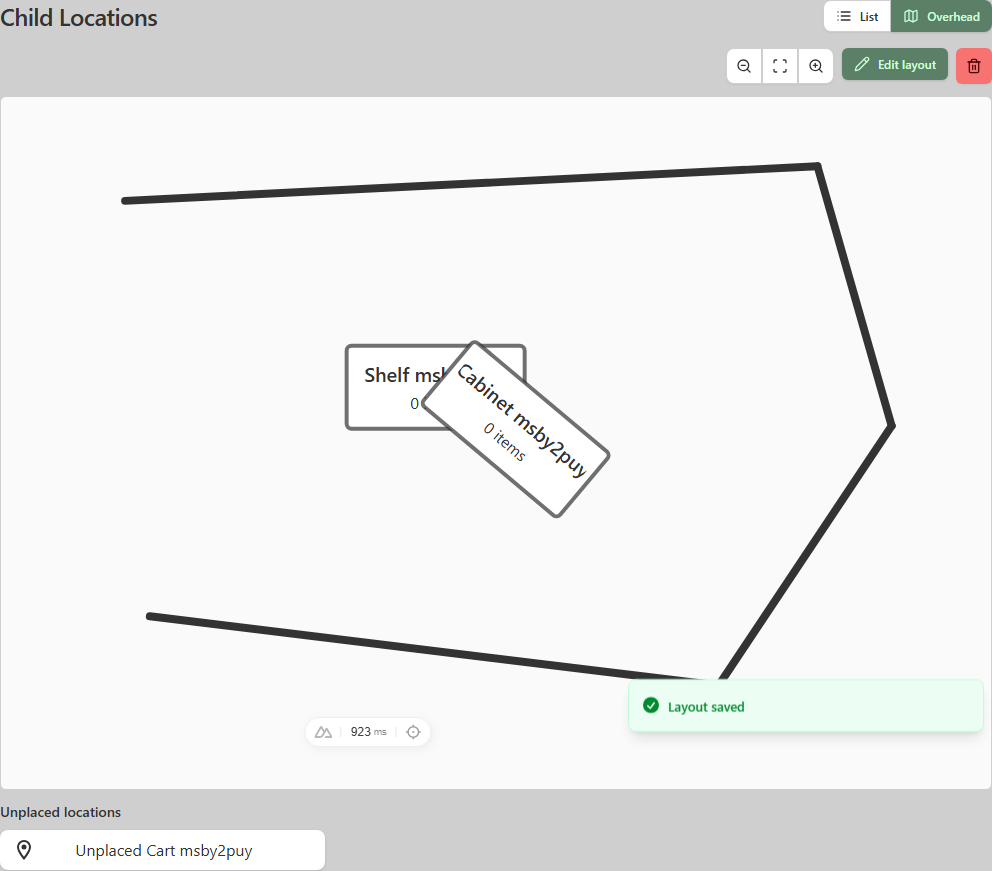
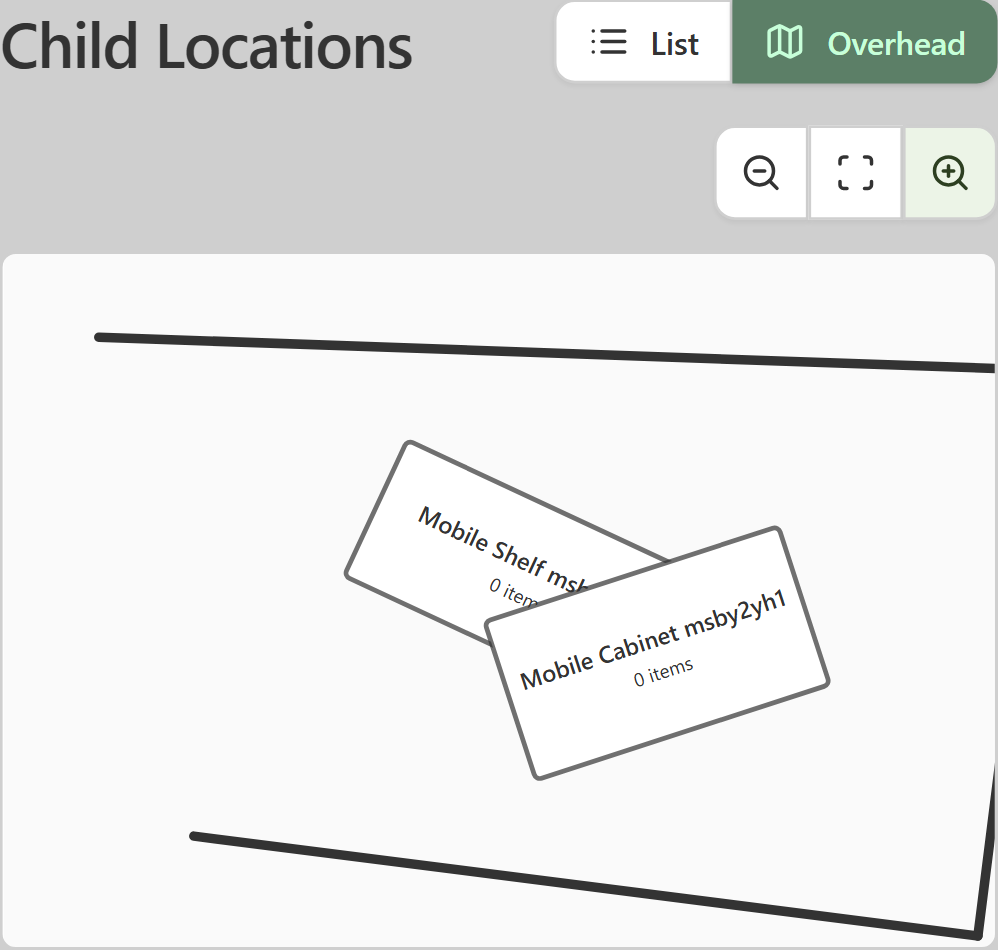

# Overhead Room Layout: Native Mobile Handoff

## Purpose

Homebox location pages can now show a simple overhead diagram for navigation. A layout belongs to one location (the room) and contains:

- Wall segments that approximate the room outline.
- Rotatable rectangular footprints linked to direct child locations.
- An unplaced list for direct child locations that are not on the diagram.

This is not a measured floor-plan system. V1 has no units, doors, windows, background images, item placements, nested descendants, custom labels, or custom colors.

## Visual Reference

### Desktop viewer and editor entry



Key behaviors:

1. `List` and `Overhead` form a segmented view selector.
2. Viewer controls are zoom out, fit, and zoom in.
3. Desktop users can enter the editor or delete the complete layout.
4. Footprints show the current child-location name and direct item count.
5. Open wall outlines are valid.
6. Overlapping and rotated footprints are valid. The topmost footprint receives the tap.
7. Unplaced child locations remain navigable below the canvas.

### Mobile viewer



The current web V1 intentionally makes mobile read-only. A native client should first match this viewer. A later native editor can use the editor contract below without changing the API.

## Native Screen Behavior

### View selection

- Keep `List` as the default when no layout exists.
- When a layout exists and the user has not chosen a preference, default to `Overhead`.
- Store the user's last `List`/`Overhead` choice locally per client.
- Do not synchronize the view preference through the API.
- If `GET layout` returns revision `0`, treat the layout as missing.

### Overhead viewer

- Preserve a logical canvas aspect ratio of `1000:700`.
- Fit the complete logical canvas initially.
- Support pinch zoom and one-finger pan after zooming.
- Provide explicit zoom out, fit, and zoom in controls for accessibility.
- Clamp zoom to a practical client range; the web client uses `0.5x` to `3x`.
- Draw walls behind location footprints according to `zOrder`.
- Draw each footprint around its center, then apply `rotation` in degrees.
- Clip long labels to the footprint. Never resize the canvas because of a label.
- Show the current location name and direct item count from the latest layout response.
- On tap, open `/location/{targetId}` or the native location detail equivalent.
- Use the topmost `zOrder` when placements overlap.
- Expose an accessibility label such as `Shelf A, 4 items`.
- Show all valid, unplaced direct child locations below the canvas.

### Empty states

- No child locations and no layout: keep the existing child-location empty behavior.
- Child locations but no layout: show the list and a desktop/tablet `Create layout` command.
- Existing layout with no elements: show the empty canvas and all children as unplaced.
- A moved child may temporarily be absent from both the old diagram and its unplaced list because it is no longer a direct child. The server prunes that stale placement on the next save.

## Native Designer Behavior

The first native release may remain viewer-only. If implementing a native designer, match these interactions:

### Tools

- **Select:** select, move, resize, rotate, or delete a footprint or wall.
- **Pan:** drag the canvas without changing geometry.
- **Wall:** drag from a start point to an end point to create one wall segment.

Use icon buttons with accessible names. Keep undo, redo, zoom out, fit, and zoom in available while editing.

### Wall drawing

- Convert the drag start and end from screen coordinates into normalized canvas coordinates.
- Optional grid snapping uses increments of `0.025`.
- Optional endpoint snapping selects the nearest existing wall endpoint within `0.018` normalized units.
- Endpoint snapping takes precedence after grid snapping.
- Do not auto-close the outline.
- Do not infer doors or enforce that footprints are inside walls.

### Location placement

- Show only unplaced direct child locations in the placement tray.
- Drag or tap a child to create a default `0.18 x 0.12` footprint.
- Center the new footprint at the drop point and clamp its unrotated bounds to the canvas.
- A target can appear only once.
- Labels always come from server data; do not persist editable labels.

### Manipulation

- Move using the footprint body.
- Resize from corner handles while keeping positive width and height.
- Rotate using a dedicated handle around the footprint center.
- Normalize rotation to the range `-180 <= rotation <= 180`.
- Delete the current selection with a visible command and hardware keyboard delete where available.
- Record geometry snapshots for undo/redo. Do not send intermediate edits to the server.
- Save replaces the complete diagram in one request.

### Save conflict

Every save includes the revision loaded by the editor:

1. Send `PUT` with `expectedRevision`.
2. On `200`, replace local state with the response and close the editor.
3. On `409`, discard the stale editing session, fetch the latest layout, close the editor, and show: `This layout changed in another session. The latest version has been loaded.`
4. Do not silently merge geometry in V1.

## Coordinate Model

The API stores normalized values from `0` through `1`. Canvas dimensions are metadata and are fixed at `1000 x 700`.

```text
screenX = viewportOriginX + panX + normalizedX * 1000 * zoom
screenY = viewportOriginY + panY + normalizedY * 700  * zoom

normalizedX = (screenX - viewportOriginX - panX) / (1000 * zoom)
normalizedY = (screenY - viewportOriginY - panY) / (700  * zoom)
```

For a location footprint:

```text
centerX = (x + width / 2)  * 1000
centerY = (y + height / 2) * 700
```

Apply rotation around `(centerX, centerY)`. Geometry bounds are validated before rotation, so rotated corners may visually extend beyond the logical canvas.

## API Contract

All endpoints require the existing Homebox bearer authentication and collection context.

### Get

```http
GET /api/v1/entities/{ownerLocationId}/layout
```

A missing layout returns `200` with an empty canvas:

```json
{
  "canvasWidth": 1000,
  "canvasHeight": 700,
  "revision": 0,
  "walls": [],
  "locations": []
}
```

An existing layout returns valid walls and valid direct-child placements. Stale placements whose targets moved elsewhere are omitted.

```json
{
  "canvasWidth": 1000,
  "canvasHeight": 700,
  "revision": 3,
  "walls": [
    {
      "id": "6f590c39-0ce6-41fa-94ba-099a995ada77",
      "x": 0.08,
      "y": 0.1,
      "endX": 0.88,
      "endY": 0.14,
      "zOrder": 0
    }
  ],
  "locations": [
    {
      "id": "db441131-5594-4ca2-953b-7a45d6b1d82d",
      "targetId": "039c572a-85b7-4abd-b91c-b02f8bd099e0",
      "name": "Shelf A",
      "itemCount": 4,
      "x": 0.3,
      "y": 0.3,
      "width": 0.28,
      "height": 0.18,
      "rotation": 25,
      "zOrder": 1
    }
  ]
}
```

### Replace

```http
PUT /api/v1/entities/{ownerLocationId}/layout
Content-Type: application/json
```

```json
{
  "expectedRevision": 3,
  "elements": [
    {
      "id": "6f590c39-0ce6-41fa-94ba-099a995ada77",
      "kind": "wall",
      "x": 0.08,
      "y": 0.1,
      "endX": 0.88,
      "endY": 0.14,
      "width": 0,
      "height": 0,
      "rotation": 0,
      "zOrder": 0
    },
    {
      "id": "db441131-5594-4ca2-953b-7a45d6b1d82d",
      "kind": "location",
      "targetId": "039c572a-85b7-4abd-b91c-b02f8bd099e0",
      "x": 0.3,
      "y": 0.3,
      "width": 0.28,
      "height": 0.18,
      "endX": 0,
      "endY": 0,
      "rotation": 25,
      "zOrder": 1
    }
  ]
}
```

Important:

- Omit `targetId` for walls. Do not send an empty UUID string.
- New elements may omit `id`; the server assigns one.
- The operation is atomic and replaces every prior element.
- A successful save increments `revision`.
- A stale `expectedRevision` returns `409`.
- Invalid owner, target, duplicate target, or geometry returns a client error.

### Delete

```http
DELETE /api/v1/entities/{ownerLocationId}/layout
```

Returns `204`. This deletes the diagram, not the owner location or child locations.

## Server Rules

- The owner and targets must belong to the authenticated collection.
- The owner must be a location.
- Placement targets must be direct child locations of the owner.
- A target can appear only once in a layout.
- Wall endpoints and footprint geometry must remain in normalized canvas bounds.
- Walls have no target.
- Location footprints require a target and positive width/height.
- Deleting a target location cascade-deletes its placement.
- Moving a target makes the old placement invalid; reads omit it and the next save prunes it.
- Layout owner and target IDs are remapped during collection export/import.

## Suggested Native Models

```swift
struct LocationLayout: Decodable {
    let canvasWidth: Int
    let canvasHeight: Int
    let revision: Int
    let walls: [LayoutWall]
    let locations: [LocationPlacement]
}

enum DraftElement {
    case wall(LayoutWallDraft)
    case location(LocationPlacementDraft)
}
```

Keep server response models separate from editable draft models. The response placement includes `name` and `itemCount`; save inputs do not. Derive the unplaced tray by subtracting response/draft `targetId` values from the current direct-child list.

## Acceptance Checklist

- Existing diagrams open in Overhead by default when no local preference exists.
- List/Overhead preference survives app restart.
- Pinch zoom, pan, fit, and explicit zoom controls work without horizontal page overflow.
- Rotated overlapping placements render in `zOrder`; tapping the top one navigates correctly.
- Long location names stay clipped inside footprints.
- Current direct item counts and names refresh from the server response.
- Unplaced direct children remain visible and navigable.
- No edit/delete controls appear in a viewer-only mobile release.
- A designer can draw snapped open walls, place, move, resize, rotate, delete, undo, and redo.
- Saves omit wall `targetId`, replace the full layout, and use `expectedRevision`.
- `409` closes stale editing and loads current data.
- Deleted and moved targets never produce a broken navigation target.
